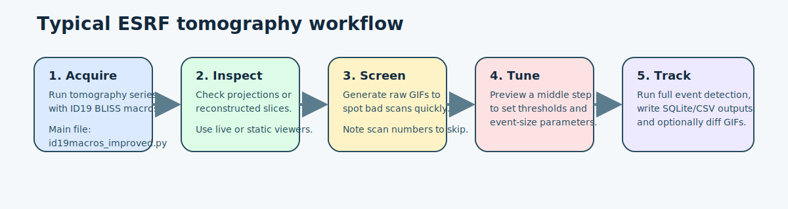
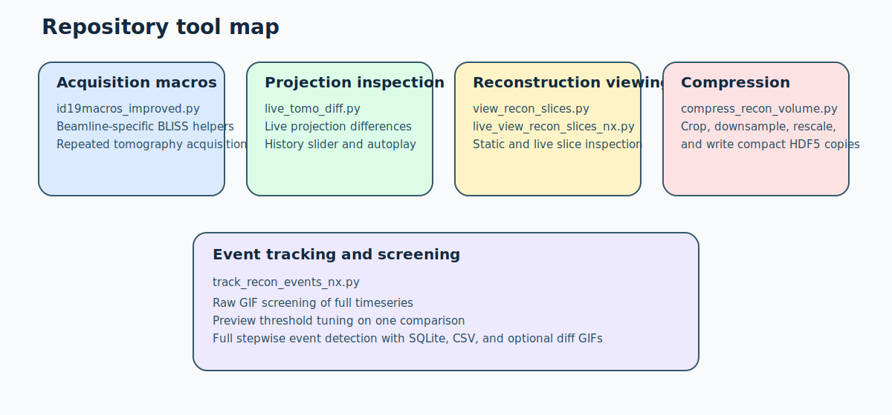

# ESRF_Scripting

Utility scripts and beamline macros for ESRF tomography workflows.

This repository is a mix of:

- BLISS beamline macros for acquisition on ID19
- quick inspection tools for projections and reconstructions
- live viewers that auto-follow new datasets or reconstructions
- reconstruction post-processing helpers
- stepwise reconstruction-difference tracking and GIF generation

Most scripts are standalone command-line tools with their own focused README.



## Repository Layout



### Acquisition macros

- [id19macros_improved.py](./id19macros_improved.py)
  - BLISS macros for repeated tomography, positioning, and beamline configuration
  - See [README_id19macros_improved.md](./README_id19macros_improved.md)

### Projection-level live tools

- [live_tomo_diff.py](./live_tomo_diff.py)
  - live projection-radiogram difference viewer for tomography series
  - can auto-follow newer datasets and keep a browsable history
  - See [README_live_tomo_diff.md](./README_live_tomo_diff.md)

### Reconstruction viewers

- [view_recon_slices.py](./view_recon_slices.py)
  - lightweight single-file reconstruction slice viewer
  - See [README_view_recon_slices.md](./README_view_recon_slices.md)

- [live_view_recon_slices_nx.py](./live_view_recon_slices_nx.py)
  - live reconstruction viewer for numbered tomography series
  - supports auto-following newer reconstructions and showing differences
  - See [README_live_view_recon_slices_nx.md](./README_live_view_recon_slices_nx.md)

### Reconstruction processing

- [compress_recon_volume.py](./compress_recon_volume.py)
  - crop, downsample, rescale, and compress reconstruction volumes
  - can operate on a single file or a numbered series
  - See [README_compress_recon_volume.md](./README_compress_recon_volume.md)

### Reconstruction event tracking

- [track_recon_events_nx.py](./track_recon_events_nx.py)
  - stepwise reconstruction-difference tracking across a numbered timeseries
  - can preview thresholds, export screening GIFs, and write SQLite/CSV summaries
  - See [README_track_recon_events_nx.md](./README_track_recon_events_nx.md)

## Typical Workflow

For a numbered tomography reconstruction series, the intended progression is usually:

1. Acquire a series with the BLISS macros if relevant.
2. Inspect raw reconstructions or live updates with the reconstruction viewers.
3. Optionally compress reconstruction volumes for lighter downstream use.
4. Screen the series visually with raw GIFs using `track_recon_events_nx.py`.
5. Exclude bad scans, tune detection parameters in preview mode, then run full event tracking.

The most detailed walkthrough for that last stage is in [README_track_recon_events_nx.md](./README_track_recon_events_nx.md).

## Requirements

The Python tools in this repository generally depend on some combination of:

- `numpy`
- `matplotlib`
- `h5py`
- `imageio`
- `Pillow`
- `scipy`

The BLISS macro file additionally depends on the ESRF beamline control environment and is not meant to run as a standalone Python script.

## Data Assumptions

Several tools assume ESRF-style tomography layouts, especially numbered dataset series such as:

```text
collection_name/
  sample_name_first_position/
  sample_name_first_position_0002/
  sample_name_first_position_0003/
```

and reconstruction outputs such as:

```text
dataset_name/reconstructed_volumes/**/*.hdf5
dataset_name/reconstructed_slices/**/*.hdf5
```

The exact assumptions differ by script, so use the script-specific README before running on a new dataset layout.

## Starting Points

If you are new to the repo, the most useful entry points are usually:

- [README_track_recon_events_nx.md](./README_track_recon_events_nx.md) for reconstruction screening and event tracking
- [README_live_view_recon_slices_nx.md](./README_live_view_recon_slices_nx.md) for live reconstruction monitoring
- [README_live_tomo_diff.md](./README_live_tomo_diff.md) for projection-level live comparisons
- [README_compress_recon_volume.md](./README_compress_recon_volume.md) for size reduction and export
